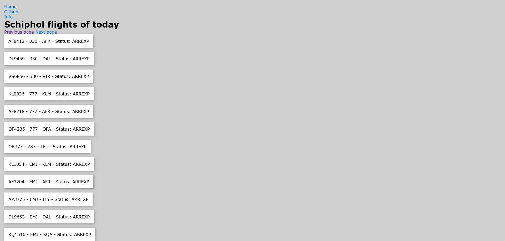

# API @cmda-minor-web 2023 - 2024

(Add nice intro whenever I'm done with this project)

## Week 1

The task at hand is to create a progressive web app, making use of an API. It is mostly about server side JavaScript so we're using node, express and some sort of templating engine. I have dabbled in server side JS a bit in blok tech, but I haven't tried to do anything with it since. So this is definitely gonna be a refresher for me.

What I do know is what I want to use for the templating engine, which is liquidJS. I've used EJS in the past, but I didn't really like working with it so this seems like an opportunity to try something else out.

I've been thinking of 2 main concept I might want to do for my project.

### Concept idea's...

**RuneScape account information**

This would be the third time I do something with RuneScape... In any case, I would use the [Wise Old Man API](https://docs.wiseoldman.net/players-api/player-endpoints) using the players API to retrieve player information. With this API I can find everything about someones account. So, the idea is to create a website where you can search for someones username. Once you find a player you can enter the players detailspage where you can find all sorts of data associated to that player. Things like level statistics, boss killcount and other activities.

**Schiphol Flight API**

With the Schiphol Flight API you can find all sorts of up-to-date information about flights on a specific date. I'm particularly interested in flightnumber, destination airport and aircraft type. So my idea with this one is that you can select a date and then see each flight of that date. There's also a quirk with this API that it will only get 10 'datapoints' before it will add pagination. So I would only be able to see 10 flights per page in this case. So another challenge with this concept is to add multiple pages if it's needed.

### Progress
So far I've thought of the concepts so I will have to choose one to start working on it. I've also made a server with LiquidJS as the template engine so that's working nicely so far. It's still hard to wrap my head around how everything works, but I'll just have to keep trying stuff and asking a lot of questions.

## Week 2

In week 2 I made some decent progress.

### Schiphol Flights API
I've chosen the Schiphol Flights API instead of Wise Old Man, since I've previously used it and there's some fun things you can do with the Flights API. So far I've succesfully called the API and am able to display the Schiphol flights of today.

As you can see there are some weird texts on each list item. These are from left to right: flight name, aircraft type, airliner and flightstatus. So what I want to do is that you can click on one of these list items and check in more detail what each of these mean. The detailpage will be in the style of the airliner, so if it's a KLM flight, it'd be blue and white. And the main thing is it would explain what the current status of the plane is. For example DEP means the aircraft is currently taxiing to the runway. So I want to give the most common flight statuses some kind of icon or small animation that visually shows what's happening. So one plane could be a KLM 737 that's delayed on it's way to Heathrow airport. The detailpage would be in the KLM style, showing an medium sized airplane that's flying very slow. 

I might want to enhance this app with another API, currently I'm thinking about the [airports](https://api-ninjas.com/api/airports) API which shows a bit more information about the airport. In the Schiphol Flights API it will only give you the airport code, but a normal person wouldn't even know what it means. So with that API I could maybe change it to the normal name of the airport (i.e. Schiphol Airport instead of EHAM).