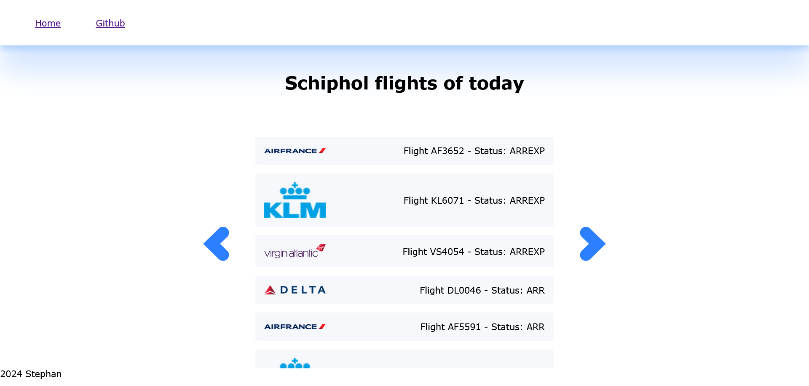
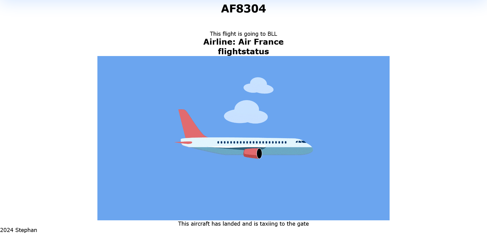
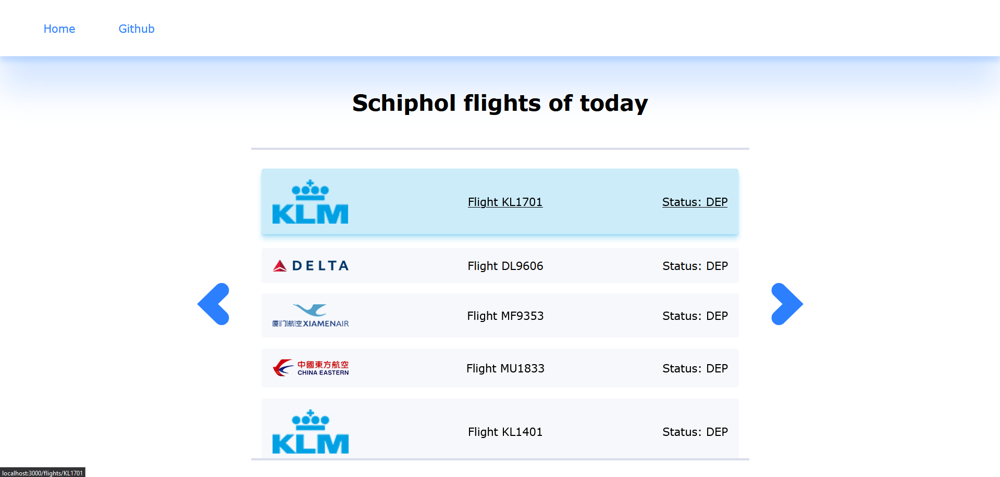
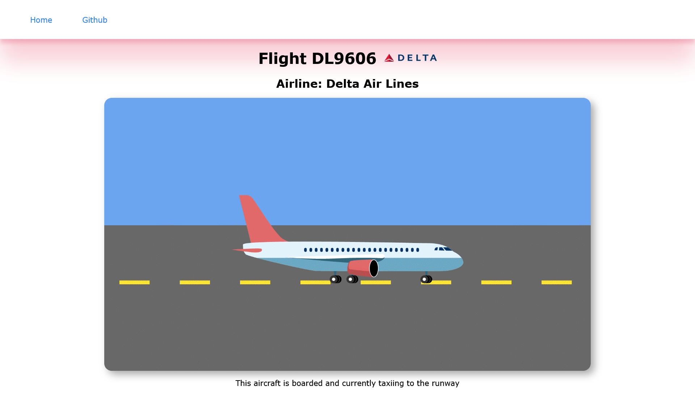

# API @cmda-minor-web 2023 - 2024

(Add nice intro whenever I'm done with this project)

## Week 1

The task at hand is to create a progressive web app, making use of an API. It is mostly about server side JavaScript so we're using node, express and some sort of templating engine. I have dabbled in server side JS a bit in blok tech, but I haven't tried to do anything with it since. So this is definitely gonna be a refresher for me.

What I do know is what I want to use for the templating engine, which is liquidJS. I've used EJS in the past, but I didn't really like working with it so this seems like an opportunity to try something else out.

I've been thinking of 2 main concept I might want to do for my project.

### Concept idea's...

**RuneScape account information**

This would be the third time I do something with RuneScape... In any case, I would use the [Wise Old Man API](https://docs.wiseoldman.net/players-api/player-endpoints) using the players API to retrieve player information. With this API I can find everything about someones account. So, the idea is to create a website where you can search for someones username. Once you find a player you can enter the players detailspage where you can find all sorts of data associated to that player. Things like level statistics, boss killcount and other activities.

**Schiphol Flight API**

With the Schiphol Flight API you can find all sorts of up-to-date information about flights on a specific date. I'm particularly interested in flightnumber, destination airport and aircraft type. So my idea with this one is that you can select a date and then see each flight of that date. There's also a quirk with this API that it will only get 10 'datapoints' before it will add pagination. So I would only be able to see 10 flights per page in this case. So another challenge with this concept is to add multiple pages if it's needed.

### Progress
So far I've thought of the concepts so I will have to choose one to start working on it. I've also made a server with LiquidJS as the template engine so that's working nicely so far. It's still hard to wrap my head around how everything works, but I'll just have to keep trying stuff and asking a lot of questions.

## Week 2

In week 2 I made some decent progress.

### Schiphol Flights API
I've chosen the Schiphol Flights API instead of Wise Old Man, since I've previously used it and there's some fun things you can do with the Flights API. So far I've succesfully called the API and am able to display the Schiphol flights of today.


As you can see there are some weird texts on each list item. These are from left to right: flight name, aircraft type, airliner and flightstatus. So what I want to do is that you can click on one of these list items and check in more detail what each of these mean. The detailpage will be in the style of the airliner, so if it's a KLM flight, it'd be blue and white. And the main thing is it would explain what the current status of the plane is. For example DEP means the aircraft is currently taxiing to the runway. So I want to give the most common flight statuses some kind of icon or small animation that visually shows what's happening. So one plane could be a KLM 737 that's delayed on it's way to Heathrow airport. The detailpage would be in the KLM style, showing an medium sized airplane that's flying very slow. 

I might want to enhance this app with another API, currently I'm thinking about the [airports](https://api-ninjas.com/api/airports) API which shows a bit more information about the airport. In the Schiphol Flights API it will only give you the airport code, but a normal person wouldn't even know what it means. So with that API I could maybe change it to the normal name of the airport (i.e. Schiphol Airport instead of EHAM).

## Week 3

### Airlines API
Sadly I didn't make a lot of progress this week. I had a small loss of motivation which resulted in having not made as much progress as I wanted. Still however, I wanted to add something extra. Last week I talked about wanting to use the airports API to use the normal names of airports. Well I haven't used that one YET but I did use another endpoint called airlines. With this one I was able to get the images if the airlines to display in the list. 



### Flight statuses
I have also been able to showcase different texts/images based on the status of the airplane. For example, the current detailpage looks like this:



So the gif is not correct, but the idea is that depending on the status a different gif of a plane should be displayed. Since the status of this example was ARR, it should've been an animation of an airplane taxiing to the gate. But you get the idea. The way I do this is simply by giving the source of the gif the name of the flightstatus:

```html

```

So if a call a gif in that folder ARR.gif, it will show that specific gif.

### Going forward
So I've made <em>some</em> progress, but not a lot. After the last feedback conversation I've decided to make a priority list of what I want to do and try to get as far as possible:
- Finish detailpage gifs
- Better styling
- Fix images that are not showing
- Manually add Transavia logo
- Add airport API

If I atleast finish the first 2 or 3 points, I should get a pretty decent, albeit very simple app going on. So I'm not super happy with my progress and how it will probably end up, but atleast I should have something presentable before the final test. 

## Week 4

### Final touch ups
In the weekend and monday before the final assignment I've managed to mostly get my app in a decent state. 

On the main page I now have different hover states depending on which flight you hover on. I've also added the transavia logo manually because that one didn't have a logo for some reason. 



I also changed the accent color of the page based on the color of the airliner. And for the most common flightstatusses I've added animations that correspond to that status.



### Reflection
So... The site works. But obviously it's very simple and just uses the basic things I can do with the API. So from that angle I would've liked to do something more creative with the data that I got from the API. 

But I'm also happy with some stuff. For one, the fact that I got it working with logo's and pagination! I'm very happy with that and it actually looks decent. I sadly wasn't able to fix the airliners without a name or logo, but most of them are working. I'm also glad that I could do something with the colors of the airline branding and that it's working properly.

### Reflection rant...
However, I'm still kinda frustrated with how I did this project. I constantly am feeling like I can't do anything besides the absolute basics in JavaScript, let alone with nodejs and whatever modules that are being added. One of my goals this minor was to gain a better understanding of what I'm actually doing when coding. Initially I meant this in general, but the more projects I do, should definitely be meant for JavaScript. Anytime I start to do something in JavaScript, I try do to it myself. I'm reading the documentation, googling stuff etc. But I really don't get any progress whatsoever. So at some point I just resort to asking chatgpt or github copilot or whatever and it will fix it for me very quickly. But I don't learn anything from that, and it's very frustrating. I can't do it entirely myself, but I'm also not learning anything when asking AI. This ended up being very demotivating which results in me not enjoying it too much.

I guess the solution is to ask the teachers for help and advice, but it seems like I am a bit too afraid to seem incompetent or whatever. I'm not sure what it is, but I should really take action and ask for advice whenever I am stuck. Definitely some advice to myself to take with me to the next project. I know this final section was a bit rambly, but I definitely needed to get this off my chest.